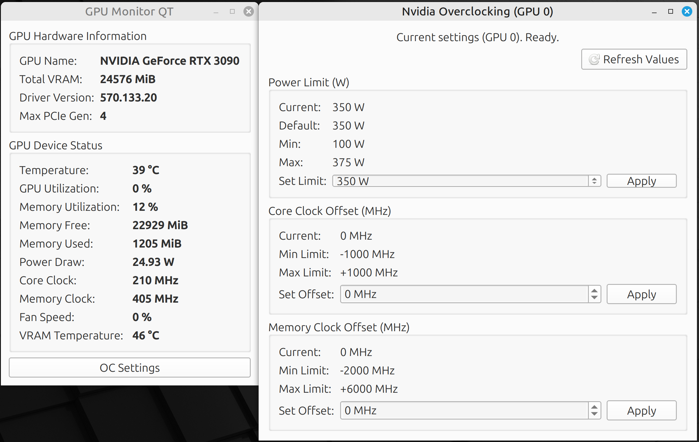

# GPU Monitor QT

A lightweight Nvidia GPU monitoring tool for **Linux**, built with Python and PySide6.



*(Work in progress - v0.2)*

## Features (Implemented - v0.2)

**GPU Hardware Info:**
*   Display GPU Name (e.g., NVIDIA GeForce RTX 4070)
*   Display Total VRAM (e.g., 8192 MiB)
*   Display Current Driver Version
*   Display Maximum PCIe Link Generation

**GPU Monitoring (Updates every second):**
*   Display GPU Core Temperature (°C)
*   Display VRAM Temperature (°C) (**Experimental:** Requires compilation)
*   Display GPU Utilization (%)
*   Display Memory Controller Utilization (%)
*   Display Free Video Memory (MiB)
*   Display Used Video Memory (MiB)
*   Display Current Power Draw (W)
*   Display Current Graphics (Core) Clock (MHz)
*   Display Current Memory Clock (MHz)
*   Display Current GPU Fan Speed (%)

**GPU Overclocking:**
*   Control Core Clock Offset
*   Control Memory Clock Offsets
*   Control Power Limit (requires elevated privileges)

## Features (Planned)
*   Add graphs/plots for monitored values over time
*   Control Fan Speed / Fan Curve
*   Create Profiles for settings

## Installation

**Prerequisites:**

*   **Linux Operating System:** This tool is currently designed **only for Linux**.
*   **NVIDIA GPU:** An NVIDIA graphics card is required.
*   **NVIDIA Proprietary Drivers:** You must have the official NVIDIA drivers installed. These drivers provide the `nvidia-smi` command-line utility, which this tool relies on. You can usually install these through your distribution's package manager or download them from the NVIDIA website.
*   **`nvidia-smi` command:** Verify this command works in your terminal by running `nvidia-smi`. If it doesn't, your drivers are likely not installed correctly or not loaded.
*   **Python:** Python 3 (version 3.7 or newer recommended) needs to be installed. Check with `python3 --version`.
*   **Git:** Required to clone the repository.
*   **`libpci-dev`:** Required for compiling the VRAM temperature helper. Install using your package manager (e.g., `sudo apt install libpci-dev` on Debian/Ubuntu).
*   **C Compiler:** A C compiler like `gcc` is needed (`build-essential` package usually provides this).

**Steps:**

1.  **Clone the repository:**
    Open your terminal and run:
    ```bash
    git clone https://github.com/flailbot/gpu_mon_qt.git
    ```

2.  **Navigate into the project directory:**
    ```bash
    cd gpu_mon_qt
    ```

3.  **(Recommended) Create and activate a Python virtual environment:**
    This isolates the project's dependencies.
    ```bash
    # Create the environment (named .venv)
    python3 -m venv .venv

    # Activate the environment
    source .venv/bin/activate
    ```
    You should see `(.venv)` appear at the beginning of your terminal prompt.

4.  **Install the required Python packages using `requirements.txt`:**
    Make sure your virtual environment is activated (if you created one).
    ```bash
    pip install -r requirements.txt
    ```

5.  **(Optional) Compile VRAM Temperature Helper:**
    The VRAM temperature reading feature is **experimental** and requires compiling a small C helper program **on your own system**.
    **Code Source:** The C code in `src/gddr6_helper.c` is adapted from the [gddr6 project by olealgoritme](https://github.com/olealgoritme/gddr6). Many thanks to them for figuring out the necessary hardware offsets!
    To enable the experimental VRAM temperature reading (for compatible RTX 3000/4000 series GPUs), compile the C helper program:
    ```bash
    # Navigate to the src directory within the project
    cd src
    # Compile the helper
    # Make sure libpci-dev is installed (e.g., sudo apt install libpci-dev on Debian/Ubuntu)
    gcc gddr6_helper.c -o gddr6_helper -lpci
    # Optional: Strip debug symbols to make it smaller
    strip gddr6_helper
    # Go back to the project root
    cd ..
    ```
    This creates the `gddr6_helper` executable inside the `src` directory.
## Usage

1.  **Open your terminal.**

2.  **Navigate to the project directory** where you cloned the repository:
    ```bash
    cd path/to/gpu_mon_qt
    ```

3.  **(If using a virtual environment) Activate the virtual environment:**
    ```bash
    source .venv/bin/activate
    ```

4.  **Run the application:**
    ```bash
    python main.py
    ```

5.  The GPU Monitor window should appear, displaying your GPU information and updating the status metrics every second.

    *   **VRAM Temperature Note:** If you compiled the `gddr6_helper`, the application will attempt to run it using `sudo` to read the VRAM temperature.
    *   **Sudo Requirement:** You will likely be prompted for your password by `sudo` *unless* you configure passwordless `sudo` specifically for the `gddr6_helper` executable. This is necessary because accessing GPU hardware registers directly requires root privileges.
    *   **Configuring Passwordless Sudo (Use with caution):**
        If you understand the security implications and want to avoid the password prompt, you can add a line to your sudoers file. **Be very careful editing this file.** Run `sudo visudo` and add a line like this (replace `$USER` with your actual username and verify the path to `gddr6_helper` is correct):
        ```
        # Allow user $USER to run gddr6_helper without a password
        $USER ALL=(ALL) NOPASSWD: /path/to/gpu_mon_qt/src/gddr6_helper
        ```
        Save and exit the editor.
    *   If the helper fails (due to permissions, incompatible GPU, kernel parameters like `iomem=relaxed` not set, etc.), the VRAM temp field will show an error ("No Root?", "Not Supported", "Error") or may be hidden.

    *   **Troubleshooting:** If the application shows "Error", "N/A", or doesn't start, ensure your NVIDIA drivers are correctly installed and the `nvidia-smi` command runs without errors in your terminal. Check the terminal output where you ran `python main.py` for specific error messages printed by the application (e.g., "nvidia-smi not found", "Error executing nvidia-smi").

## Acknowledgments

*   The VRAM temperature reading functionality (`src/gddr6_helper.c`) is based on the code and research from the [gddr6 project by olealgoritme](https://github.com/olealgoritme/gddr6).

## License

This project is licensed under the GNU GPL v3 license - see the LICENSE file for details.